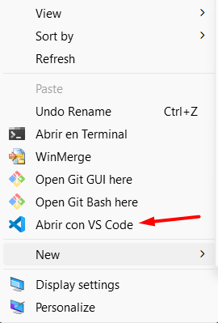

# 🖥️ Agregar "Abrir con VS Code" al menú contextual de Windows



## 🚀 Descripción
Este plugin agrega la opción **"Abrir con VS Code"** al menú contextual del Explorador de Windows.

## 📂 Métodos de instalación
Puedes usar los archivos `.bat` disponibles en este repositorio: (IMPORTANTE: Ejecutar como administrador)

- 📄[install_open_with_vscode.bat](install_open_with_vscode.bat)
- 📄[uninstall_open_with_vscode.bat](uninstall_open_with_vscode.bat)

O bien, hacerlo manualmente siguiendo estos pasos. 👇

---

## 🔧 Instalación Manual
1️⃣ **Descarga el siguiente script y guárdalo como** `install_open_with_vscode.bat`:

```bat
@echo off
:: Instalar "Abrir con VS Code" en el menú contextual de Windows

reg add "HKEY_CLASSES_ROOT\Directory\Background\shell\OpenWithVSCode" /ve /t REG_SZ /d "Abrir con VS Code" /f
reg add "HKEY_CLASSES_ROOT\Directory\Background\shell\OpenWithVSCode" /v "Icon" /t REG_SZ /d "C:\Users\%USERNAME%\AppData\Local\Programs\Microsoft VS Code\Code.exe" /f
reg add "HKEY_CLASSES_ROOT\Directory\Background\shell\OpenWithVSCode\command" /ve /t REG_SZ /d "\"C:\Users\%USERNAME%\AppData\Local\Programs\Microsoft VS Code\Code.exe\" \"%%V\"" /f

reg add "HKEY_CLASSES_ROOT\Directory\shell\OpenWithVSCode" /ve /t REG_SZ /d "Abrir con VS Code" /f
reg add "HKEY_CLASSES_ROOT\Directory\shell\OpenWithVSCode\command" /ve /t REG_SZ /d "\"C:\Users\%USERNAME%\AppData\Local\Programs\Microsoft VS Code\Code.exe\" \"%%1\"" /f

echo Instalación completada. Ahora puedes hacer clic derecho en cualquier carpeta y verás "Abrir con VS Code".
pause
```

2️⃣ **Ejecuta el script como Administrador** (doble clic o "Ejecutar como Administrador").

3️⃣ **Reinicia el Explorador de Windows** con el siguiente comando:
   ```cmd
   taskkill /f /im explorer.exe & start explorer
   ```

4️⃣ **Verifica que la opción** "Abrir con VS Code" **aparezca al hacer clic derecho sobre una carpeta o fondo del explorador**.

---

## 🗑️ Desinstalación
Si deseas eliminar la opción **"Abrir con VS Code"**, puedes usar el archivo `.bat` disponible en el repositorio o hacerlo manualmente:

1️⃣ **Descarga el siguiente script y guárdalo como** `uninstall_open_with_vscode.bat`:

```bat
@echo off
:: Desinstalar "Abrir con VS Code" del menú contextual de Windows

reg delete "HKEY_CLASSES_ROOT\Directory\Background\shell\OpenWithVSCode" /f
reg delete "HKEY_CLASSES_ROOT\Directory\shell\OpenWithVSCode" /f

echo Desinstalación completada. "Abrir con VS Code" ha sido eliminado del menú contextual.
pause
```

2️⃣ **Ejecuta el script como Administrador**.

3️⃣ **Reinicia el Explorador de Windows** con el comando:
   ```cmd
   taskkill /f /im explorer.exe & start explorer
   ```
   
4️⃣ **La opción ya no estará en el menú contextual.** ✅

---

## 📜 Licencia
Este proyecto es de código abierto y se distribuye bajo la licencia [MIT](LICENSE). ¡Sientete libre de contribuir! 🚀
